# HTTP

##  Reference 
- [모든 개발자를 위한 HTTP 웹 기본 지식](https://www.inflearn.com/course/http-%EC%9B%B9-%EB%84%A4%ED%8A%B8%EC%9B%8C%ED%81%AC/dashboard);

## IP (인터넷 프로토콜)
Internet Protocol

### 인터넷 프로토콜의 역할
- 지정한 IP 주소에 데이터 전달
- 패킷(Packet)이라는 통신 단위로 데이터 전달
  - 패킷에는 출발지 IP, 목적지 IP, 전송 데이터 등이 실린다

클라이언트가 서버로 패킷을 전달할 때 여러 노드를 거쳐서 서버에 전달된다

### IP 프로토콜의 한계
- 비연결성: 패킬을 받을 대상이 없거나 서비스 불능 상태여도 패킷을 전송한다
- 비신뢰성: 중간 노드에서 패킷이 사라지거나 패킷이 순서대로 오지 않는 문제
  - 패킷을 순서대로 보내더라도 거쳐가는 노드가 다르기 때문에 보낸 순서대로 오지 않을 수 있다
- 프로그램 구분: 같은 IP를 사용하는 서버에서 통신하는 애플리케이션이 둘 이상일 때 문제

이 문제의 해결책으로 TCP, UDP가 있다

## 인터넷 프로토콜 스택의 4계층

## 프로토콜 계층

## TCP (전송 제어 프로토콜)
Transmission Control Protocol

TCP는 IP패킷에 TCP 세그먼트를 씌워운다

### TCP 특징
- 연결 지향: TCP 3 way handshake(가상 연결)
- 데이터 전달 보증
- 순서 보장: 패킷1, 2, 3을 보냈는데 패킷1, 3, 2 순서로 도착하면 패킷2부터 다시 보내라고 요청한다
- 신뢰할 수 있는 프로토콜
- 현재 대부분 TCP 사용

TCP 3 way handshake
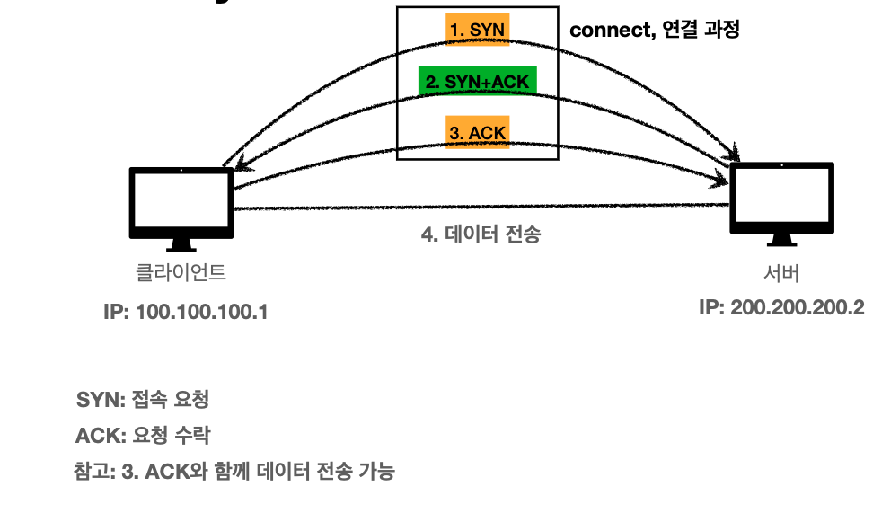

## UTP (사용자 데이터그램 프로토콜)
User Datagram Protocol

### TCP 특징
- 하얀 도화지에 비유(기능이 거의 없다)
- 연결 지향  TCP 3 way handshake X
- 데이터 전달 보증 X
- 순서 보장 X
- 단순하고 빠르다
- IP와 거의 같다. +PORT, +체크섬 정도만 추가
- 애플리케이션에서 추가 작업이 필요하다

## PORT

TCP/IP 패킷에는 출발지 IP, 출발지 PORT, 목적지 IP, 목적지 PORT, 전송 데이터 등이 들어 있다
PORT는 같은 IP 내에서 프로세스를 구분한다
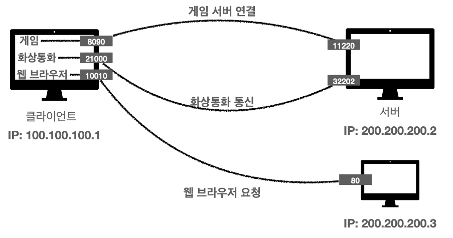

PORT는 0 ~ 65535 사이에서 할당 가능하다
- 0 ~ 1023: 잘 알려진 포트, 사용하지 않는 것이 좋다
- FTP: 20, 21
- TELNET: 23
- HTTP: 80
- HTTPS: 443

## DNS (도메인 네임 시스템)
Domain Name System
- 전화번호부
- 도메인 명을 IP 주소로 변환

IP는 기억하기 어렵고 변경될 수 있기 때문에 DNS 시스템이 필요하다
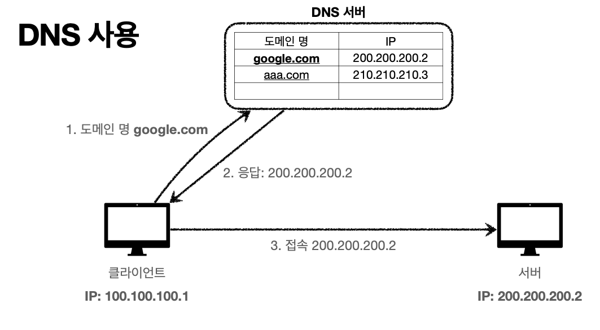

## URI (Uniform Resource Identifier)

- Uniform: 리소스를 식별하는 통일된 방식
- Resource: 자원, UIR로 식별할 수 있는 모든 것(제한 없다)
- Identifier: 다른 항목과 구분하는데 필요한 정보

### URL, URN

- URL: Locator, 리소스가 있는 위치를 지정
- URN: Name, 리소스에 이름을 부여
- 위치는 변할 수 있지만, 이름은 변하지 않는다
- URN 이름만으로 실제 리소스를 찾는 방법이 보편화 되지 않음
- URI, URL을 같은 의미라고 생각해도 무방

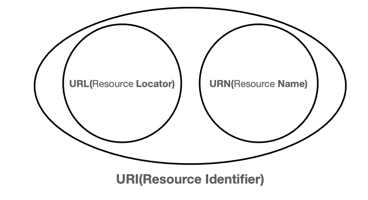

## URL

scheme://[userinfo@]host[:port][/path][?query][#fragment]

https://www.google:443/search?q=hello&hi=ko
프로토콜  호스트명    포트번호  패스   쿼리 파라미터

### scheme
- 주로 프로토콜 사용
- 프로토콜: 어떤 방식으로 자원에 접근할 것인가 하는 약속
  - ex) http, https, ftp 등
- http는 80포트, https: 443 포트를 주소 사용, 포트는 생략 가능
- https는 http에 보안 추가한 것

### userinfo
- URL 에 사용자 정보를 포함해서 인증
- 거의 사용하지 않는다

### host
- 호스트명
- 도메인 명 또는 IP 주소를 직접 사용가능

### port
- 접속 포트
- 일반적으로 생략한다, 생략시 http는 80 https는 443

### path
- 리소스 경로, 계층적 구조
- ex) /home/profile
      /member/id=1

### quert
- key=value 형태
- ? 로 시작, & 로 추가 기능 ?keyA=valueA&keyB=valueB
- query parameter, query string 등으로 부른다, 웹서버에 제공하는 파리미터, 문자 형태

### fragment
- html 내부 북마크 등에 사용
- 서버에 전송하는 정보 아니다

## 웹 브라우저 요청 흐름
https://www.google:443/search?q=hello&hi=ko

1. HTTP 요청 메서지를 생성한다

GET /search?q=hello&hi=ko HTTP/1.1
HOST: www.google.com

2. SOCKET 라이브러리를 통해 전달
  - TCP/IP 연결
  - 데이터 전달

3. TCP/IP 패킷 생성, HTTP 메시지 포함

4. 웹 브라우저는 서버로 요청 패킷을 전달한다

5. 서버는 요청 패킷을 받고 응답 패킷을 전달한다

6. 웹 브라우저는 응답 패킷을 받고 HTML을 렌더링한다

## HTTP (HyperText Transfer Protocol)

모든 것이 HTTP
HTTP 메시지에 모든 것을 전송
- HTML, TEXT,
- IMAGE, 음성, 영상 파일
- JSON, XML (API)
- 거의 모든 형태의 데이터 전송 가능
- 서버간에 데이터를 주고 받을 때도 대부분 HTTP 사용
- 서버간에 데이터를 주고 받을 때도 대부분 HTTP 사용

### 기반 프로토콜

- TCP: HTTP/1.1, HTTP/2
- UDP: HTTP/3
- 현재 HTTP/1.1을 주로 사용한ㄷ

### HTTP 특징

#### 클라이언트 서버 구조
독립적으로 잔화 가능하다
- Request Response 구조
- 클라이언트는 서버에 요청하고, 응답을 대기한다
- 서버가 요청에 대한 결과를 만들어서 응답한다

#### 무상태 프로토콜
스테이스리스(Stateless)
- 서버가 클라이언트의 상태를 보존 X
- 장점: 서버 확정성이 높다
- 단점: 클라이언트가 추가 데이터 전송해야 한다

#### Stateful, Stateless 차이

고객: 클라이언트, 점원: 서버

Stateful(상태 유지)
중간에 다른 점원으로 바뀌면 안 된다
중간에 정보가 바뀔 떼 싱태정보를 다른 점원에게 미리 말해줘야 한다

Stateless (무상태)
중간에 다른 점원으로 바뀌어도 된다
중간에 서버가 고장이나면 다른 서버가 응답 가능하다
갑자기 고객이 중가해도 점원이 대거 투압할 수 있다
무상태는 응답 서버를 쉽게 바꿀 수 있다 -> 무한한 서버 증설 가능

Stateless의 한계
- 모든 것을 무상태로 설계할 수 있는 경우도 있고 없는 경우도 있다
- 무상태 ex) 로그인이 필요없는 단순한 서비스 소개 화면
- 상태유지 ex) 로그인
- 로그인한 사용자의 경우 로그인 했다는 상태를 서버에 유지
- 일반적으로 브라우저 쿠키와 서버 세션등을 사용해서 상태 유지
- 상태 유지는 최소한만 사용

### 비연결성 (commectionless)
- HTTP는 기본이 연결을 유지하지 않는 모델이다
- 일반적으로 초 단위의 이하의 빠른 속도로 응답한다
- 1시간동안 수천명이 서비스를 사용해도 실제 서버에서 동시에 처리하는 요청은 수십개 이하로 매우 작다
  - ex) 웹 브라우저에서 계속 연결해서 검새버튼을 누르지는 않는다
- 서버 자원을 매우 효율적으로 사용할 수 있다

#### 한계와 극복
- TCP/IP 연결을 새로 맺어야 한다  3 way handshake 시간 추가
- 웹 브라우저로 사이트를 요청하면 HTML 뿐만 아니라 자바스크립트, css, 추가 이미지등 수많은 자원이 함께 다운로드
- 지금은 HTTP 지속연결(Persistent Connections)로 문제해결
- HTTP/2, HTTP/3에서 더 많은 최적화

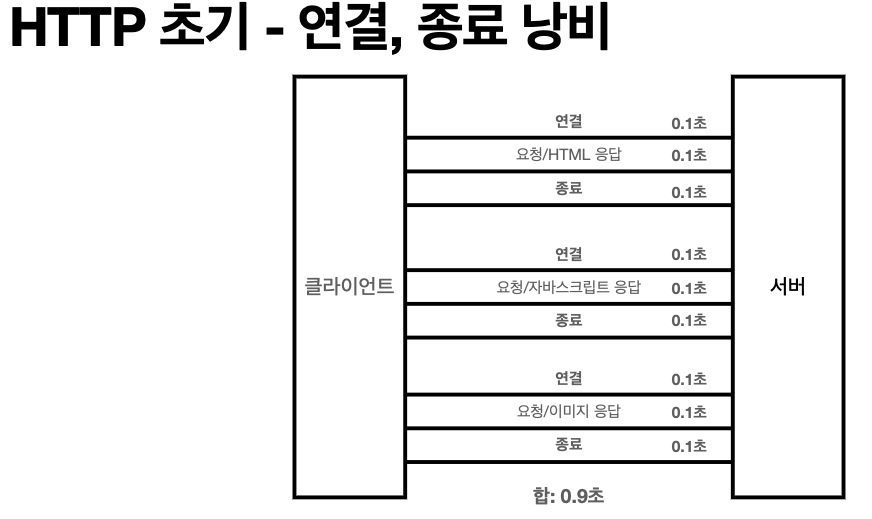
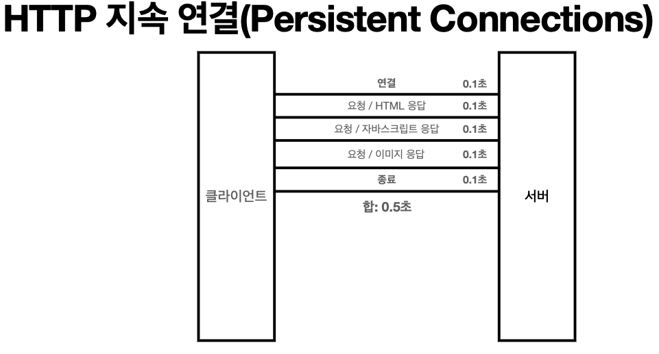

## HTTP 메시지
HTTP 메시지에 모든 것을 전송한다

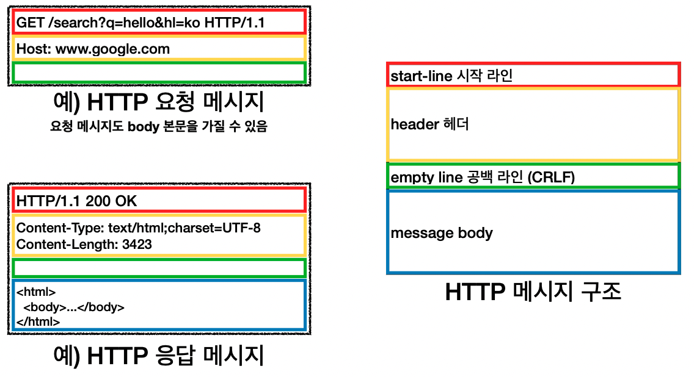

### 시작 라인
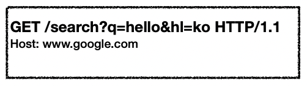

#### 요청 메시지
HTTP 메서드

- 종류: GET, POST, PUT, DELETE...
- 서버가 수행해야 할 동작 지정
  - GET: 리소스 조회
  - POST: 요청 내역 처리

요청 대상 
- absolute-path[?query]  (절대경로[?쿼리])
- 절대경로="/"로 시작하는 경로

HTTP 버전
- HTTP/1.1

#### 응답 메시지
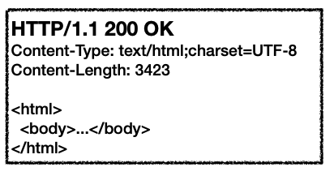

시작 라인
- HTTP 버전
- HTTP 상태 코드: 요청 성공, 실패를 나타냄
  - 200: 성공
  - 400: 클라이언트 요청 오류
  - 500: 서버 내부 오류
- 이유 문구

HTTP 헤더
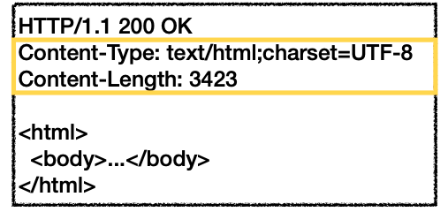

- HTTP 전송에 필요한 모든 부가정보
- ex) 메시지 바디의 내용, 메시지 바디의 크기, 압축, 인증, 요청 클라이언트(브라우저) 정보, 서버 애플리케이션 정보, 캐시 관리 정보

HTTP 메시지 마디
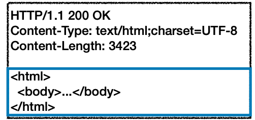

- 실제 전송할 데이터
- HTML 문서, 이미지, 영상, JSON 등등 byte로 표현할 수 있는 모든 데이터 전송 가능

## API URI 설계

ex) 회원 정보 관리 API를 만들어보자
- 회원 목록 조회
- 회원 조회
- 회원 등록
- 회원 수정
- 회원 삭제

중요한 것은 **리소스 식별**

리소스의 의미란?
- 회원을 등록하고 수정하고 조회하는 것이 리소스가 아니다
- 회원이라는 개념 자체가 바로 리소스다

리소스를 어떻게 식별하는 것이 좋을가?
- 회원을  등록하고 수정하고 조회하는 것을 모두 배제
- 회원이라는 리소스만 식별하면 된다 -> 회원 리소스를 URI에 매핑

가장 중요한 것은 리소스와 행위를 분리하는 것
- URI는 리소스만 식별
- 리소스와 해당 리소스를 대상으로 하는 행위를 분리
  - 리소스: 회원
  - 행위: 조회, 등록, 삭제, 변경
- 리소스는 명사, 행위는 동사
- 행위는 HTTP 메서드로 구분한다

## HTTP 메서드

#### GET 
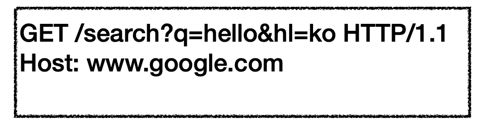

- 리소스 조회
- 서버에 전달하고 싶은 데이터는 query(쿼리 파라미터, 쿼리 스트링)를 통해서 전달
- 메서지 바디를 사용해서 데이터를 전달할 수 있지만, 지원하지 않는 곳이 많아서 권장하지 않음

#### POST

- 새 리소스 생성(등록)
  - 서버가 아직 식별하지 않은 새 리소스 생성
- 요청 데이터 처리
  - 단순히 데이터를 생성하거나 변경하는 것을 넘어서 프로세스를 처리해야 하는 경우
  - ex) 주문에서 결재완료 -> 배달시작 -> 배달완료 처럼 단순히 변경을 넘어 프로세스 상태가 변경되는 경우
  - POST 결과로 새로운 리소스가 아직 생성되지 않을 수 있음
  - ex) POST/orders/{orderId}/start-delivery (컨트롤 URI)
- 다른 메서드로 처리하기 애매한 경우
  - ex) JSON으로 조회한 데이터를 넘겨야 하는데 GET 메서드를 사용하기 어려운 경우
  - 애매하면 POST

#### PUT
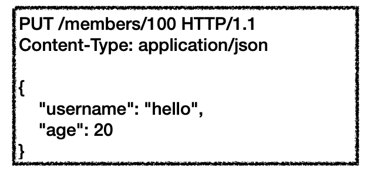

- 리소스를 대체
  - 리소스가 있으면 완전히 대체(덮이쓴다)
  - 리소스가 없으면 생성
- 클라이언트가 리소스를 식별
  - 클라이언트가 리소스 위치를 알고 URI 지정
  - POST와 차이점

#### PATCH

- 리소스 부분 변경

#### DELETE

- 리소스 삭제

## HTTP 메서드의 속성
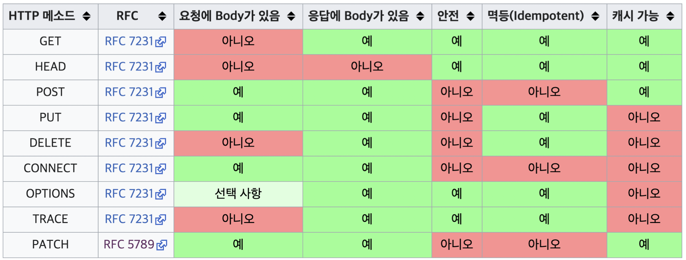

### 안전
- 호출해도 리소스를 변경하지 않는다
- 해당 리소스가 변하냐 변하지 않냐만 고려한다

### 멱등
- f(f(x)) = f(x)
- 한번 호출하든 두번 호출하든 100번 호출하든 결과는 똑같다
- 멱등 메서드
  - GET: 한번 조회하든 두번 조회하든 같은 결과가 조회된다
  - PUT: 결과를 대체한다. 따라서 같은 요청을 여러번 해도 최종결과는 같다
  - DELETE: 결과를 삭제한다. 같은 요청을 여러번 해도 삭제된 결과는 똑같다
  - POST: 멱등이 아니다. 두번 호출하면 같은 결제가 중복해서 발생할 수 있다
- 멱등은 외부 요인으로 중간에 리소스가 변경되는 것까지는 고려하지 않는다

### 캐시가능
- GET, HEAD, POST, PATCH 는 캐시 가능하다
- 실제로는 GET, HEAD 정도만 캐시로 사용한다
  - POST, PATCH는 본문 내용까지 캐시 키로 고려해야해서 구현이 쉽지 않다

## HTTP 메서드 활용

### 클라이언트에서 서버로 데이터 전송

#### 데이터 전달 방식
- 쿼리 파라미터를 통한 데이터 전송
  - GET
  - 주로 정렬 필터(검색어)
- 메시지 바디를 통한 데이터 전송
  - POST, PUT, PATCH
  - 회원가입, 상품주문, 리소스 등록/변경

#### 데이터 전달 상황
- 정적 데이터 조회
  - 이미지, 정적 텍스트 문서
  - 조회는 GET 사용
  - 정적 데이터는 일반적으로 쿼리 파라미터 없이 리소스 경로로 단순하게 조회 가능
- 동적 데이터 조회
  - 주로 검색, 게시판 목록에서 정렬 필터(검색어)
  - 조회 조건을 줄여주는 필터, 조회 결과를 정렬하는 정렬 조건에 주로 사용
  - 조회는 GET 사용
  - GET은 쿼리 파라미터를 사용해서 데이터 전달
- HTML Form을 통한 데이터 전송
  - HTML Form submit시 POST 전송
    - 회원가입, 상품주문, 데이터 변경
  - Content-Type: application/x-www-form-urlencoded 사용
    - form의 내용을 메시지 바디를 통해 전송(key=value, 쿼리 파라미터 형식)
    - 전송 데이터를 url encoding처리
  - HTML Form은 GET 전송도 가능
  - Context-Type: multipart/form-data
    - 파일 업로드 같은 바이너리 데이터 전송시 사용
    - 다른 종류의 여러 파일과 폼의 내용 함께 전송 가능
  - HTML Form 전송은 GET, POST만 지원
- HTTP API를 통한 데이터 전송
  - 서버 to 서버
    - 백엔드 시스템 통신
  - 앱 클라이언트
  - 웹 클라이언트
    - HTML에서 Form 전송 대신 자바스크립트를 통한 통신에 사용(AJAX)
  - POST, PUT, PATCH: 메서지 바디를 통해 데이터 전송
  - GET: 조회, 쿼리 파라미터로 데이터 전달
  - Content-Type: application/json을 주로 사용
    - TEXT, XML, JSON