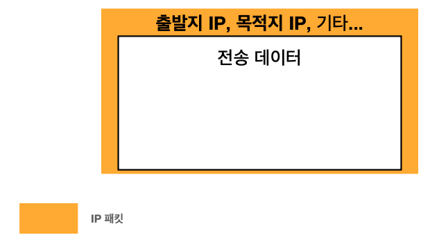
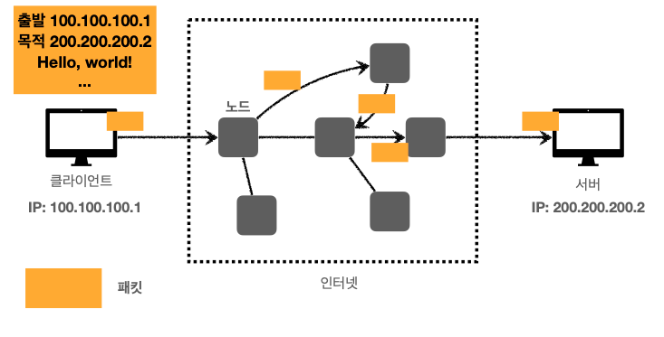
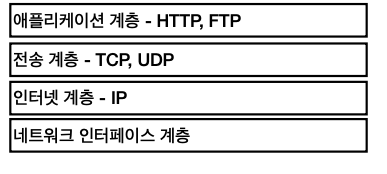
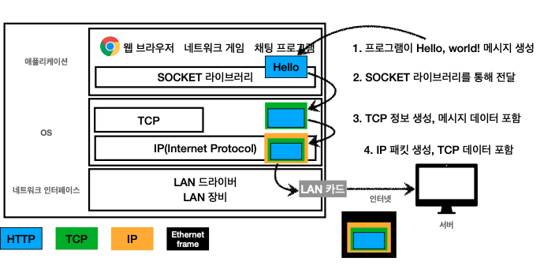
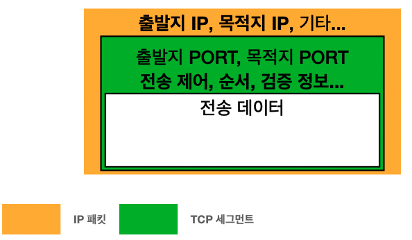

# HTTP

##  Reference 
- [모든 개발자를 위한 HTTP 웹 기본 지식](https://www.inflearn.com/course/http-%EC%9B%B9-%EB%84%A4%ED%8A%B8%EC%9B%8C%ED%81%AC/dashboard);

## IP (인터넷 프로토콜)
Internet Protocol

### 인터넷 프로토콜의 역할
- 지정한 IP 주소에 데이터 전달
- 패킷(Packet)이라는 통신 단위로 데이터 전달
  - 패킷에는 출발지 IP, 목적지 IP, 전송 데이터 등이 실린다

클라이언트가 서버로 패킷을 전달할 때 여러 노드를 거쳐서 서버에 전달된다

### IP 프로토콜의 한계
- 비연결성: 패킬을 받을 대상이 없거나 서비스 불능 상태여도 패킷을 전송한다
- 비신뢰성: 중간 노드에서 패킷이 사라지거나 패킷이 순서대로 오지 않는 문제
  - 패킷을 순서대로 보내더라도 거쳐가는 노드가 다르기 때문에 보낸 순서대로 오지 않을 수 있다
- 프로그램 구분: 같은 IP를 사용하는 서버에서 통신하는 애플리케이션이 둘 이상일 때 문제

이 문제의 해결책으로 TCP, UDP가 있다

## 인터넷 프로토콜 스택의 4계층

## 프로토콜 계층

## TCP (전송 제어 프로토콜)
Transmission Control Protocol

TCP는 IP패킷에 TCP 세그먼트를 씌워운다

### TCP 특징
- 연결 지향: TCP 3 way handshake(가상 연결)
- 데이터 전달 보증
- 순서 보장
- 신뢰할 수 있는 프로토콜
- 현재 대부분 TCP 사용

