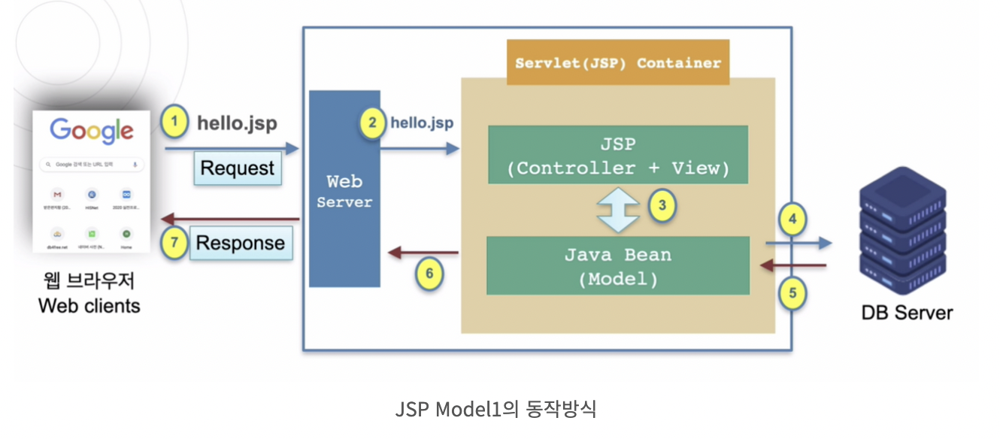
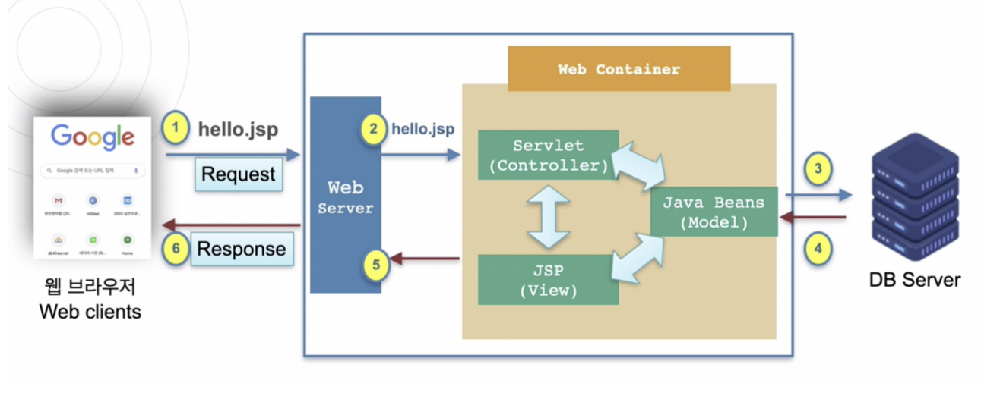
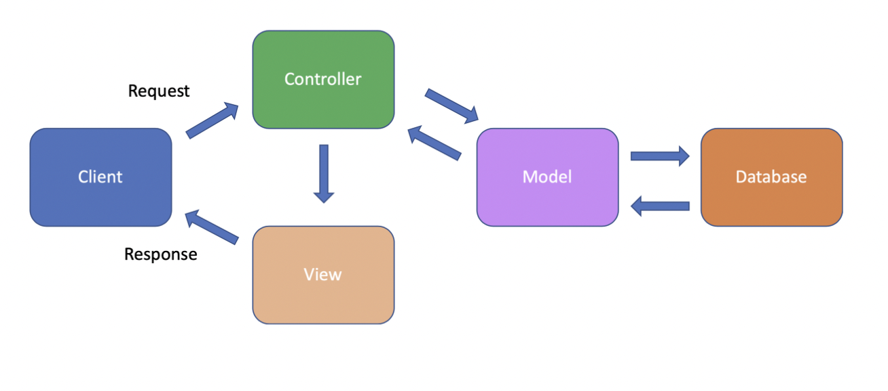
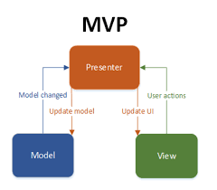
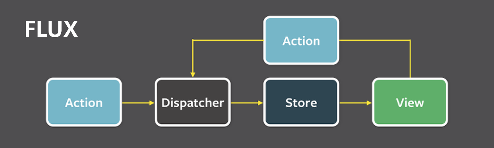

## API, SDK

- API(Application Progamming Interface): 응용 프로그램 인터페이스
- SDK(System Developer's Kit): 시스템 개발자용 키트

API는 응용 프로그램이 **자신과 연관된 프로그램을 만들 수 있도록 제공하는 인터페이스**다,
애플리케이션 소프트웨어를 구축하고 통합하기 위한 정의 및 프로토콜 세트이다

- 프로토콜: 컴퓨터 내부에서 또는 컴퓨터 사이에서 데이터의 교환 방식을 정읳는 규칙체게이ㅏㄷ
  기기 간 통신은 교환되는 데이터의 형식에 대해 상호 합의를 요구한다
  이러 형식을 정의하는 규칙의 집합을 프로토콜이라 한다
  API는 클랑드 네이티브 애플리케이션 개발을 통해 자체 인프라를 연결하는 간소화된 방식이지만
  고객 및 다른 외부 사용자와 데이터를 허용하기도 한가 (ex: Google Maps API)

SDK는 하드웨어 플랫폼, 운영 체제 또는 프로그래밍 언어 제작사가 제공하는 일련의 툴이다
소프트웨어 개발자는 SDK를 활용하여 특정 플랫폼, 시스템 또는 프로그래밍 언어에 따라
애플리케이션을 개발할 수 있다
이를 직접 조립할 수 있는 옷장에 포함되어 있는 도구 키트라고 생각하면 된다

## 객체 지향형 프로그래밍 5가지 원칙

Object Oriented Programming, OOP라 불리며 캡슐화, 다형성, 상속을 이용하여
코드 재사용을 증가시키고 유지보수를 감소시키는 장점을 얻기 위해서
객체들을 연결해 프로그래밍하는 기법이다

### 객체 지향형 프로그램이 가지는 특정

- 캡슐화(Encapsulation): 객체의 내용 중 숨기고 싶은 부분을 외부에서 접근할 수 없게
  감출 수 있다. 이는 정보의 은닉과 보호가 가능하다

- 추상화(Abstraction): 객체들의 공통된 특징을 파악해 정의해 놓은 설계기법이다

- 다형성(Polymorphism): 코드의 재사용성이 증가되고 폭 넓은 코드 구현이 가능하며
  개발 속도를 향상 시킬 수 있다

  - 하나의 지시(메소드를 실행시키는 것)에 대해 여러 객체가 다른 행위를 수행하는 것이다
  - Overloading(오버로딩)과 Oberriding(오버라이딩)으로 표현된다

- 상속성(Inheritance): Class의 멤버(데이터)와 함수를 다른 Classㅇ 물려주거나
  물려 받을 수 있는 기능으로 다형성을 확보 할 수 있다

### 객체 지향형 프로그래밍 5원칙

#### SRP

단일 책원 원칙(Single Responseibility Principle)

- 모든 클래스는 단 하나의 책임을 가진다. 클래스를 수정할 이유는 오직 하나여야 한다
- 계산기 클래스는 계산하는 책임과 GUI를 나타내는 책임은 서로 분리되어야 한다
- 계산기 클래스에 GUI를 나타내는 부분까지 있을 경우 SRP를 위반한 것이다

#### OCP

개방-폐쇠 원칙(Open-Closed Principle)

- 확장에 대해서는 개방되어 있어야 하지만 수정에 대해서는 폐쇠적이어야 한다

#### LSP

리스코프 치환 원칙(Liskov Substitution Principle)

- 자식 클래스는 언제나 자신의 부모 클래스를 대신할 수 있다
- 부모 클래스가 위치하는 자리에 자식 클래스를 대치되어도 잘 작동해야 한다

#### ISP

인터페이스 분리 원칙(Interface Segregation Principle)

- 클라이언트는 자신이 이용하지 않는 메서드에 의존하지 않아야 한다
- 클래스는 자신이 사용하지 않는 인터페이스는 구현되지 말아야 한다
- 하나의 일반적인 인터페이스보다 여러개의 구체적인 인터페이스가 낫다

#### DIP

의존 역전 원칙(Dependency Inversion Principle)

- 상위 클래스는 하위 클래스에 의존해서는 안된다

## 함수형 프로그래밍

Functional Programming 기능을 순수 함수로 나누어 구현하는 기법이다

자료 처리를 수학적 함수의 계산으로 취급하고 상태와 가변 데이터를 멀리하는
프로그래밍 패러다임의 하나이다

기존 명령형 프로그래밍에서, 명령형 함수는 프로그램의 상태를 변경시킬 수 있었다
따라서 명령형 함수는 참조 투명성이 없고 같은 코드라도 실행되는 프로그램의 상태에 따라
다른 결과값을 낼 수 있다

그에 반해 함수형 프로그래밍은 함수의 출력값이 입력된 인수에만 의존하므로 부작용을 효율적으로
제거하면서 프로그램의 동작을 이해하고 동작을 예측하기 쉬워진다

## 순수 함수란

순수 함수는 같은 입력이 주어지면 같은 출력을 반환해야 한다
즉 부가 효과(side effect)가 존재하면 안된다
부가 효과가 발생하면 순수 함수로서의 기능을 하지 못해 예측 불가능한 오류를 일으킬 수 있다

## 객체 지향 프로그래밍과 함수형 프로그래밍의 가장 큰 차이

객체 지향 프로그래밍은 클래스와 객체의 관계가 중심으로 구성되므로 상태, 멤버 변수, 메서드 등이
긴밀하게 의존한다. 이는 멤버 변수가 가진 상태에 따라 결과가 변한다는 것이다

함수형 프로그래밍은 순수 함수와 보조 함수의 조합으로 상태를 제어하는 복잡성을 최소화하고
변수의 사용을 억제하여 상태 변경을 피해 최적화된 동작을 만들어 낼 수 있다
함수형 프로그래밍은 객체 지향 프로그래밍을 대체하는 것이 아니라, 큰 추상화는 객체 지향적으로 했더라도 인스턴스의 메서드 로직 작성에서의 for, if, break를 대체하는 것이다

## 라이브러리, 프레임워크

### 라이브러리

단순하게 활용 가능한 도구들의 집합으로 개발자가 필요에 의해 만든 클래스를 호출하여 사용하는 방식이다
공통으로 사용될 수 있는 특정한 기능을 모듈화한 것으로 사용자가 직접 실행할 수는 없다

### 프레임워크

소프트웨어의 특정 문제를 해결하기 위해 상호간 의존하는 클래스와 인터페이스의 집합이다
완성된 어플리케이션이 아니므로 개발자가 완성시켜야 하며 특정 개념의 추상화를 제공하고 재사용 가능한
여러 클래스나 컴포넌트로 구성된다

### 차이점

두 용어의 차이점은 개발 주도성이 어디에 있는가에 차이가 있다
라이브러리는 개발자가 프로세스를 작성하면서 필요한 코드를 가져다 사용하는 반면
프레임워크는 프로세스를 가지고 있으며 개발자는 프레임워크 안에 필요한 코드를 작성한다

## Model1과 Model2

모든 기능이 합쳐져 있는 JSP Model1
Model1을 분리시켜놓은 것이 Moddel2로
MVC 패턴의 기본적인 구조이다

### Model1

모든 클리이언트 요청과 응답을 하는 JSP가 담당하는 구조

페이지(View)에 비즈니스 로직을 처리하기 위한 코드와 결과 출력을 관리하는 코드가 뒤섞여 있으며
해당 페이지에서 모든 정보를 저장(Model)하거나 처리(Controller)한다

- 장점: 단순한 페이지 작성으로 구현이 쉬워 소규모 애플리케이션에 적합하다
- 단점: 재사용이 힘들고 가독성을 떨어진다, 대규모 애플리케이션 등에서 코드가 복잡해지면 유지보수가 힘들다

### Model2

클라이언트의 요청, 응답, 비즈니스 로직 처리 부분을 모듈화한 구조

클라이언트의 요청을 하나의 Web Container가 받아 알맞게 처리한 후 그 결과를 View에 전달한다

- 장점: 처리작업의 분리로 유지보수와 확장이 용이하다
- 단점: 구조 설계를 위한 시간이 많이 소요되므로 개발 시간이 증가한다

## MVC 패턴

소프트웨어 디자인 패턴으로 Model-View-Controller의 약자이다

- Model: 애플리케이션의 정보(데이터) 담당
  - 클라이언트의 요청에서 필요한 자료를 데이터베이스에서 가져오거나 수정하여 Controller에 전달한다
- View: UI 요소 담당
  - 어떤 View가 보여질지는 Controller에 의해서 결정된다
- Controller: 데이터와 비즈니스 로직 사이의 상호동작을 관리한다
  - 클라이언트의 요청을 받고 적절한 Model에게 동작을 지시하고 Model이 처리하여 반환한 데이터를 적잘한 View로 전달한다

## MVP 패턴

MVC가 가진 Model-View-Controller 사이의 강한 결합을 해결하기 위한
소프트웨어 디자인 패턴, Model-View-Presenter

Presenter는 View로부터 입력을 Model에 요청하고 Model의 응답으로 View를 갱신하는 역할을 한다

1. View에 사용자의 인터랙션이 들어온다
2. View는 Presenter는에 액션이 들어왔다고 전달한다
3. Presenter는 View의 액션대로 Model을 구성한다
4. Update된 Presenter의 데이터를 View에 업데이트한다

View와 Presenter의 의존관계가 여전히 강하고 Controller 대신 Presenter가 복잡해지는
문제는 여전히 남아있다

## MVVM 패턴

MVP 패턴이 가진 View-Presenter의 강한 결합을 해결하기 위해 등장한 소프트웨어 디자인 패턴, Model-View-View-Model

리액트 프로그래밍과 관계가 깊다.
Model, View, View Model 사이의 의존성이 매우 낮고 각각 분리된 모듈로 존재한다
이는 한 모듈이 변경되더라도 다른 모듈에 영향을 주지 않는다는 의미이며, TDD(테스트주도개발)과
유지보수가 매우 쉬워졌다

1. View는 View Model에 이벤트(사용자 인터렉션)을 전달하고 View Model은 Model에
   데이터를 요청한다
2. Model은 View Model에게 응답혀여 데이터를 전송하고 View Model은 이를 가공하여
   저장(저장소라는 중앙 집중형 영역 활용)한다
3. 최종적으로 View는 View Model의 데이터를 결합시켜 화면을 갱신한다

## Flux 패턴

MVC 패턴은 양방향 데이터 흐름을 만들어 예측하기 어려운 버그를 발생시킨다

Flux의 가장 큰 특징은 **단방향 데이터 흐름**이다

1. 이벤트(사용자 인터렉션)가 발생하면 Dispatcher로 전달된다
2. Dispatcher는 등록된 Callback 함수를 실행하고 Store에 데이터를 전달한다
3. Store는 변경된 데이터를 View에 알린다
4. View는 변경된 데이터로 화면을 변경하거나 출력한다

## Rest, Restful, Restful API

REST(Representational State Transfer)는 웹의 장점을 최대한으로 활용할 수 있는 이키텍처이다

요즘 서버 프로그램은 다양한 브라우저와 디바이스에서도 통신을 할 수 있어야 한다
Rest 아키텍처는 이러한 Hupermedia API의 기본을 충실히 지키고 벙용성을 보장한다

REST는 자원(Resource: URI), 행위(Verb: HTTP Method), 표현(Representations)으로 구성된다

### 제약 조건과 특징
